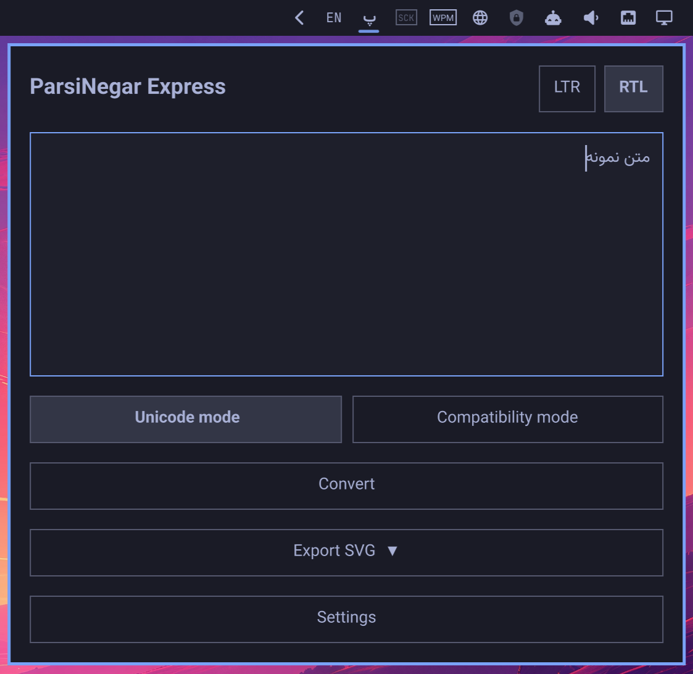
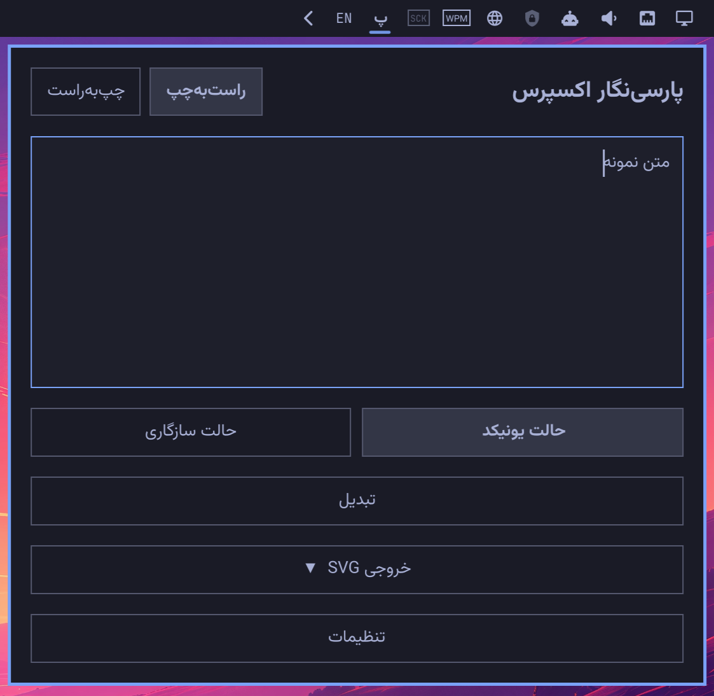
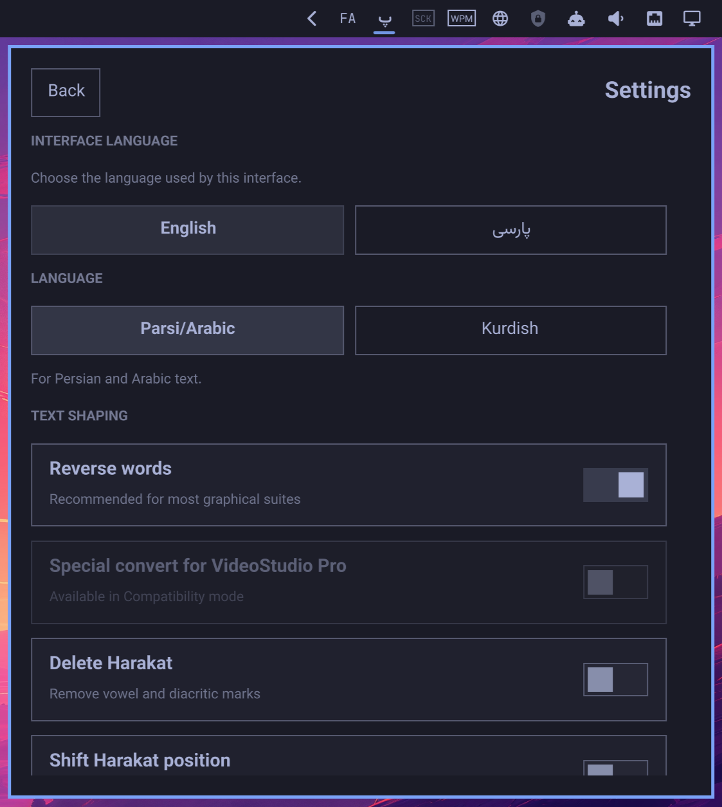

# Omarchy ParsiNegar Express

An Omarchy 4 shell plugin by LeoMoon Studios that prepares Persian and other supported right-to-left text for applications that display it disconnected or in the wrong direction, such as some graphics, video-editing, and older applications.

**Unicode mode** converts the text into contextually shaped Unicode characters, joining letters into their appropriate forms and optionally rearranging them for right-to-left display. Use this mode when the destination application accepts Unicode but does not handle Persian shaping or text direction correctly. Use a Persian-capable Unicode font in that application.

The **Hebrew** shaping profile is Unicode-only. Hebrew does not require contextual letter shaping, so this profile bypasses JsParsiReshaper and uses JsBidi only to produce visual-order text. Enable **Apply bidi visual ordering** for destination applications that do not handle right-to-left layout; leave it disabled when the destination application already supports bidi. For SVG export, choose a font that includes Hebrew glyphs; the plugin warns about missing glyphs without blocking the export.

**Compatibility mode** converts the shaped text into a legacy character mapping for special Maryam-compatible fonts. Use this mode for older applications that cannot use the Unicode output. After pasting, select the appropriate Maryam font in the destination application; otherwise the text will appear as unrelated characters. Maryam fonts are not bundled with the plugin, and this mode does not support Hebrew.

Click **پ** in the bar, type or paste your text, choose a mode, and click **Convert** to copy the result. Expand **Export SVG** below Convert to save the converted text as font-specific vector curves; Unicode starts with bundled Vazirmatn, while Compatibility export requires choosing a Maryam-compatible font. **Apply bidi visual ordering** is enabled by default and each hard-separated paragraph is ordered independently, so mixed Persian and Latin paragraphs keep their own direction. The editor aligns itself from the first strong character, using left alignment for Latin text and right alignment for Persian, Arabic, Urdu, Kurdish, and Hebrew text. The Settings view provides interface language, shaping profiles, and applicable shaping and named-ligature options; these are saved in `~/.config/leomoon-studios.omarchy-parsinegar-express/settings.json`, while draft text is never saved. The plugin UI uses bundled Vazirmatn, so no separate UI font installation is needed.

## Preview

**ParsiNegar Express - English**



**ParsiNegar Express - Persian**



**Settings**



## Features

- Contextual Persian text shaping and bidirectional reordering for applications with incomplete RTL support
- Unicode mode for standard Persian-capable fonts
- Hebrew Unicode support using bidi visual ordering without contextual reshaping
- Compatibility mode for legacy applications using Maryam-compatible fonts
- One-click conversion and clipboard copying
- RTL and LTR input controls, optional bidi visual ordering, and VideoStudio Pro conversion
- Persian/Arabic and Kurdish/Urdu contextual-shaping profiles, plus a Hebrew bidi-only profile
- Configurable diacritics, tatweel, ZWJ, and named ligatures including the Rial sign for applicable shaping profiles
- SVG curve export using the selected Unicode or compatibility font, with missing-glyph warnings
- English and Persian interfaces with persistent settings
- Lazy-loaded background processing with no activity while the menu is closed

## Install

From GitHub:

```sh
omarchy plugin add https://github.com/leomoon-studios/omarchy-parsinegar-express --enable
```

The plugin defaults to the right side of the bar. It bundles Vazirmatn v33.003 for its UI, JsBidi for bidirectional ordering, and JsParsiReshaper for contextual reshaping, so it works offline without a system Vazirmatn installation or JavaScript package installation. See [THIRD_PARTY_NOTICES.md](THIRD_PARTY_NOTICES.md) for licenses and source links, [JsBidi](https://github.com/leomoon-studios/js-bidi) for its API, and [JsParsiReshaper](https://github.com/leomoon-studios/js-parsi-reshaper) for reshaper options.

## Remove

```sh
omarchy plugin remove leomoon-studios.omarchy-parsinegar-express
```

## Compatibility

Omarchy 4.0+ on Wayland is the only supported environment.
